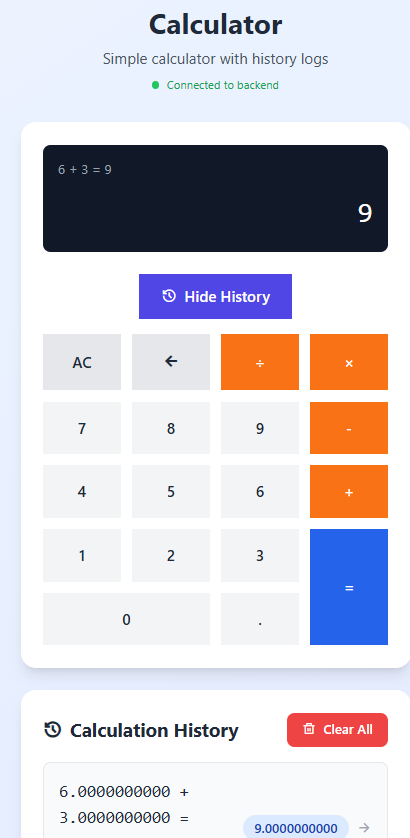
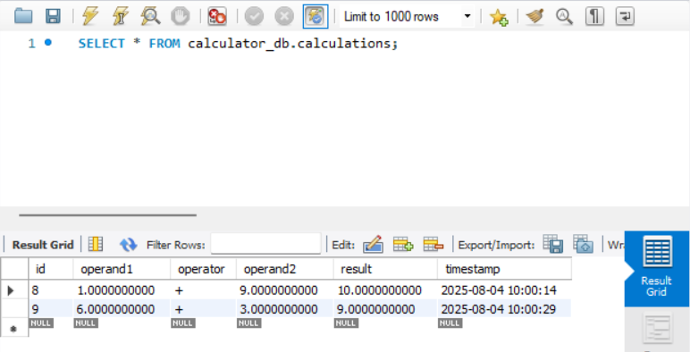

# 🧮 Simple Calculator With Logs App

A full-stack calculator application with persistent calculation history, built with Next.js frontend and Node.js/MySQL backend.





## ✨ Features

- **Modern Calculator Interface** - Clean, responsive design that works on all devices
- **Persistent History** - All calculations saved to MySQL database
- **Real-time Sync** - Instant synchronization between frontend and backend
- **Complete CRUD Operations** - Create, read, and delete calculations
- **RESTful API** - Robust backend with comprehensive error handling
- **TypeScript** - Full type safety across the entire stack

## 🚀 Quick Start

### Prerequisites
- **Node.js** 18+
- **MySQL** 5.7+ or 8.0+
- **npm** or **yarn**

### 1. Clone Repository
```bash
git clone https://github.com/pyapril15/guvi-hcl-internship-project-1.git
cd guvi-hcl-internship-project-1
```

### 2. Backend Setup
```bash
# Navigate to backend
cd backend

# Install dependencies
npm install

# Configure environment
cp .env
# Edit .env with your MySQL credentials

# Setup database
mysql -u root -p
CREATE DATABASE calculator_db;
exit

# Run migrations
npm run migrate

# Start backend server
npm run dev
```

Backend will be available at: `http://localhost:3006`

### 3. Frontend Setup
```bash
# Navigate to frontend (new terminal)
cd frontend

# Install dependencies
npm install

# Configure environment
cp .env.local
# Edit .env.local with backend URL (default should work)

# Start frontend server
npm run dev
```

Frontend will be available at: `http://localhost:3000`

## 📁 Project Structure

```
calculator-app/
├── calculator-backend/          # Node.js/Express API
│   ├── src/
│   │   ├── controllers/         # Request handlers
│   │   ├── models/             # Database operations
│   │   ├── routes/             # API endpoints
│   │   └── config/             # Database & app config
│   ├── .env                    # Backend environment variables
│   └── package.json
│
├── calculator-frontend/         # Next.js React app
│   ├── app/
│   │   ├── components/         # React components
│   │   ├── hooks/              # Custom hooks
│   │   └── utils/              # API utilities
│   ├── .env.local              # Frontend environment variables
│   └── package.json
│
└── README.md                   # This file
```

## 🔧 Configuration

### Backend Environment (.env)
```env
PORT=3006
NODE_ENV=development
DB_HOST=localhost
DB_PORT=3306
DB_USER=root
DB_PASSWORD=your_mysql_password
DB_NAME=calculator_db
FRONTEND_URL=http://localhost:3000
```

### Frontend Environment (.env.local)
```env
NEXT_PUBLIC_API_URL=http://localhost:3006/api
```

## 📡 API Endpoints

| Method | Endpoint | Description |
|--------|----------|-------------|
| GET | `/api/health` | Health check with database status |
| GET | `/api/calculations` | Get all calculations |
| POST | `/api/calculations` | Create new calculation |
| DELETE | `/api/calculations` | Delete all calculations |
| DELETE | `/api/calculations/:id` | Delete specific calculation |

## 🛠️ Development Commands

### Backend
```bash
cd backend
npm run dev              # Start development server
npm run build           # Build for production
npm run migrate         # Run database migrations
npm start              # Start production server
```

### Frontend
```bash
cd frontend
npm run dev             # Start development server
npm run build          # Build for production
npm start             # Start production server
npm run lint          # Run ESLint
```

## 🧪 Testing the Application

### Manual Testing
1. **Health Check**: Visit `http://localhost:3006/api/health`
2. **Calculator**: Open `http://localhost:3000`
3. **Perform Calculations**: Try various operations (+, -, ×, ÷)
4. **Check History**: View saved calculations
5. **Clear History**: Test the clear all functionality

### API Testing
```bash
# Create calculation
curl -X POST http://localhost:3006/api/calculations \
  -H "Content-Type: application/json" \
  -d '{"operand1":10,"operator":"+","operand2":5,"result":15}'

# Get all calculations
curl http://localhost:3006/api/calculations

# Clear all calculations
curl -X DELETE http://localhost:3006/api/calculations
```

## 🐛 Troubleshooting

**Backend won't start**
- Check MySQL is running: `sudo systemctl status mysql`
- Verify database exists: `mysql -u root -p`
- Check environment variables in `.env`

**Frontend can't connect to backend**
- Ensure backend is running on port 3006
- Verify `NEXT_PUBLIC_API_URL` in `.env.local`
- Check browser console for CORS errors

**Database connection issues**
- Test MySQL connection: `mysql -u root -p -h localhost`
- Run migrations: `npm run migrate`
- Check database credentials in `.env`

## 📊 Tech Stack

### Backend
- **Runtime**: Node.js + Express
- **Database**: MySQL with connection pooling
- **Language**: TypeScript
- **Validation**: Joi
- **Security**: Helmet.js, CORS

### Frontend
- **Framework**: Next.js 14 (App Router)
- **Language**: TypeScript
- **Styling**: Tailwind CSS
- **State Management**: React Hooks

## 🤝 Contributing

1. Fork the repository
2. Create a feature branch: `git checkout -b feature-name`
3. Make your changes
4. Test both frontend and backend
5. Commit your changes: `git commit -m 'Add feature'`
6. Push to the branch: `git push origin feature-name`
7. Submit a pull request

## 📄 License

This project is licensed under the MIT License - see the LICENSE file for details.

---

## 🎉 **Ready to Calculate!**

Your full-stack calculator application is now set up and ready to use. Both frontend and backend should be running, and you can start performing calculations with persistent history storage.

**Access Points:**
- 🌐 **Calculator App**: http://localhost:3000
- 🔧 **API Health Check**: http://localhost:3006/api/health
- 📊 **API Documentation**: See individual README files in each directory

**Happy Calculating! ✨**